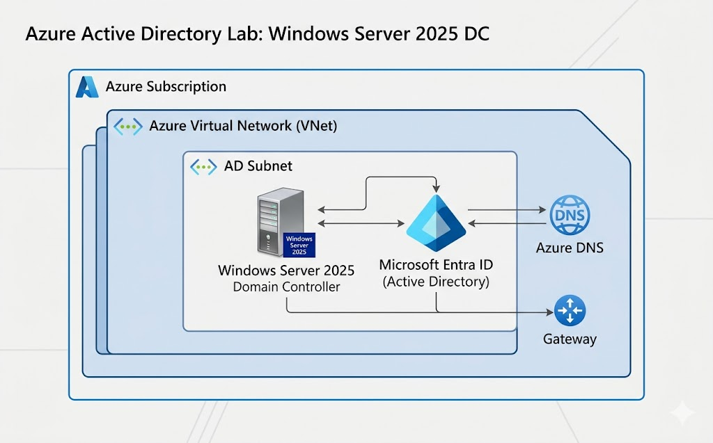
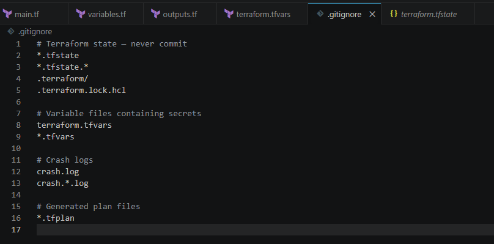
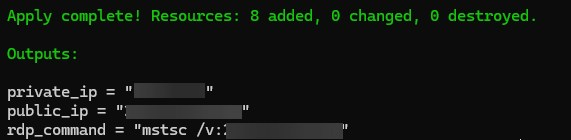
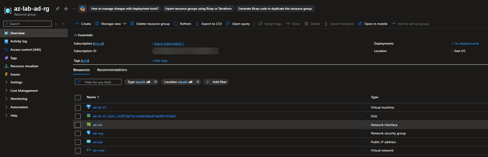

# Automating Active Directory in Azure via Terraform

**Part 2 of 2: Cloud Automation with Infrastructure as Code**

*This project covers the automated cloud deployment of an Active Directory environment. To see the foundational, on-premises manual configuration that preceded this automation, check out* [Active Directory Home Lab: Windows Server 2025](https://github.com/Dane139/ad-home-lab)

## 🛠️ Implementation Overview
This repository contains the Infrastructure as Code (IaC) required to provision a hardened Windows Server 2025 Domain Controller within a private Azure Virtual Network. The primary objective was to replace manual "Click-Ops" with a repeatable, version-controlled deployment pipeline.

### Environment & Tools

* **Cloud Provider:** Microsoft Azure
* **Provisioning:** Terraform (HCL)
* **OS:** Windows Server 2025 Datacenter
* **Identity:** Active Directory Domain Services (AD DS)

---

## 🏗️ Technical Architecture

### 1. Network Perimeter & Security
* **VNet/Subnet:** Isolated `10.0.0.0/16` network with a dedicated AD subnet.
* **NSG Hardening:** Implemented a baseline "Deny-All" inbound policy. RDP access (Port 3389) is programmatically restricted via Terraform variables to the administrator's specific Public IP.
* **Bastion Host:** Architecture designed to support Azure Bastion, ensuring management traffic remains off the public internet.

### 2. Infrastructure as Code (IaC) Logic
* **State Management:** Local `.tfstate` utilized for resource tracking and idempotency.
* **Dependencies:** Leveraged `depends_on` blocks to ensure the Network Interface and Security Group associations were fully propagated before VM initialization to prevent promotion race conditions.
* **Outputs:** Automated the generation of `mstsc` connection strings to streamline the post-provisioning handshake.

---

### 3. Execution and Provisioning

With the Azure CLI authenticated, I initiated the standard Terraform workflow:

1. `terraform init` to initialize the working directory and download the `azurerm` provider.
2. `terraform plan` to validate the syntax and preview the exact resources Azure was preparing to build.
3. `terraform apply` to execute the build.

---

### 4. Verification and Server Configuration

Using the automated RDP output command, I instantly connected to the newly provisioned Azure VM.

From here, the server was a blank slate, mirroring the exact starting point of my previous manual lab. I was able to immediately open PowerShell and execute the AD DS role installation and domain promotion scripts, successfully bridging the gap between automated cloud infrastructure and manual systems administration. The slowest part was recreating the GPOs.

---

## Enterprise Scaling Roadmap
1. **High Availability:** Implement an Availability Set with a secondary DC in a separate Fault Domain.
2. **Key Vault Integration:** Replace `.tfvars` secrets with Azure Key Vault references via Managed Identity for zero-secret exposure.
3. **Hybrid Connectivity:** Integration of a Site-to-Site VPN gateway to simulate a production-grade Hybrid Cloud environment.

---

## What I Learned

- **The Value of IaC:** Experienced firsthand how Infrastructure as Code completely eliminates "click-ops," turning a tedious 20-minute manual network setup into a 3-minute automated deployment.
- **State Management (`.tfstate`):** Gained a practical understanding of how Terraform tracks the real-world state of cloud resources against the local configuration files to ensure idempotency.
- **Dynamic Outputs:** Learned how to leverage Terraform outputs to streamline post-deployment workflows, completely eliminating the need to dig through the Azure portal to find dynamic public IP addresses.
- **Cloud Networking vs. Local Networking:** Transitioned my understanding of VirtualBox NAT/Internal networks into enterprise cloud networking concepts (Azure VNets, Subnets, and Network Security Groups).